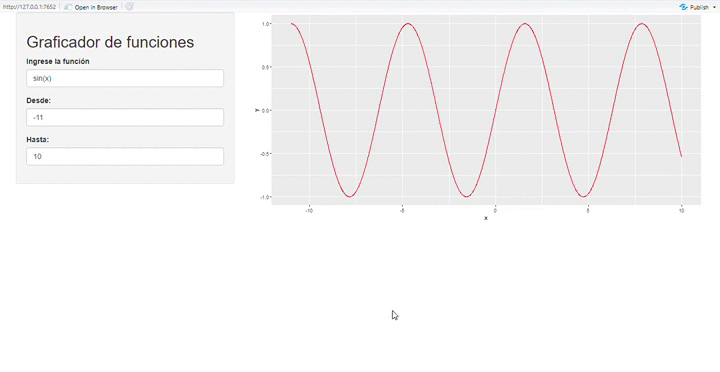

# Intro

En este post, veremos como crear una aplicación web en *shiny* que genere gráficos de funciones. Si no conoces que es shiny, mira la presentación realizada por Manuel Oviedo [aquí](https://rpubs.com/moviedo/shiny) 

# Inicio

Los paquetes necesarios son:

```{r,eval=FALSE}
library(shiny)
library(ggplot2)
```

# Interfaz (UI)

En esta parte de la aplicación se tiene tres widget, el primero un _textInput()_ donde se ingresa la función a evaluar y dos _numericInput_ que definen el recorido de la variable x. 


```{r,eval=FALSE}
ui <- shinyUI( 
  fluidPage( sidebarPanel( 
    # Titulo de la app
    titlePanel("Graficador de funciones"),
    # ingreso de la funcion 
    textInput("funcion", "Ingrese la función", "sin(x)"),
    #ingreso de 
    numericInput("from", "Desde:", 0, min = -100, max = 100) ,
    numericInput("to", "Hasta:", 10, min = -100, max = 100) ),
      mainPanel(
        plotOutput("distPlot")
      )
    )
  )

```

# Server 

En esta parte de la aplicación se evalua la función ingresada en el _textInput_, para poder realizar esta operación se utiliza la función _parse()_, la cual permite transformar el string ingresado en una expresión.  

```{r,eval=FALSE}
server <- function(input, output,session) { 
  
  datos<-reactive( { 
   x<-seq(input$from,input$to,by = 0.01)
   y<- eval(parse(text = paste(input$funcion)))
   datos<-data.frame(x,y)
  })
  output$distPlot <- renderPlot({
    ggplot(datos(),aes(x,y))+
      geom_line(colour='red')
  })
}

```

El resultado final es:


